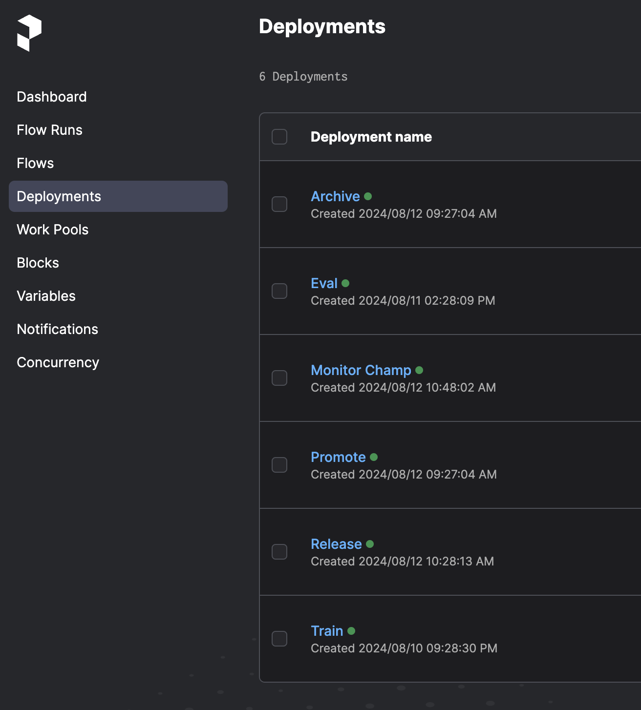
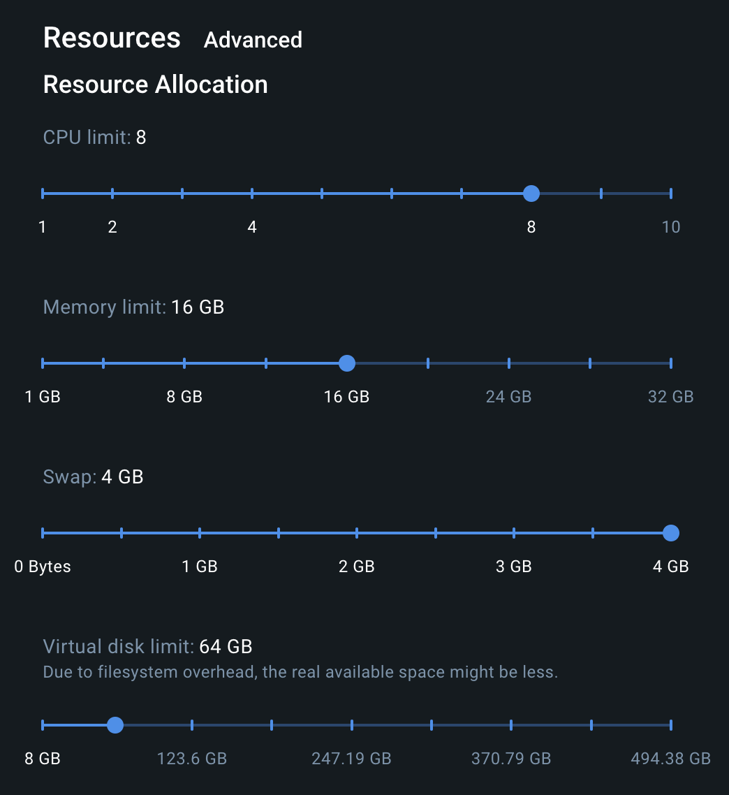

______________________________________________________________________

<div align="center">

# ll3m

<a href="https://pytorch.org/get-started/locally/"></a>
<a href="https://pytorchlightning.ai/"></a>
<a href="https://hydra.cc/"></a>
<a href="https://github.com/huggingface"></a><br>
<a href="https://github.com/martin503/ll3m/tree/main/infrastructure"></a>
<a href="https://github.com/martin503/ll3m/tree/main/infrastructure"></a>
[](https://www.localstack.cloud/)<br>
[](https://github.com/martin503/ll3m/tree/main/LICENSE)
[](https://codecov.io/gh/martin503/ll3m)
<a href="https://github.com/ashleve/lightning-hydra-template"></a><br>

</div>

## Description

All you need for novel model development workflows.

## Prerequisites
Ofc you need [docker](https://docs.docker.com/engine/install/) and [compose](https://docs.docker.com/compose/install/).

```
brew install uv awscli hashicorp/tap/terraform
```

If you want to test aws without running it on the platform you will need pro account on [localstack](https://support.localstack.cloud/knowledge-base/is-a-free-trial-available).

I have hobby license, thanks localstack ❤️

```
brew install localstack/tap/localstack-cli
```

**Sorry linux frogs you need to make it work on your own 🐸**

## First time

We will need the data for our llms. In this case we will download from kaggle toy dataset from llm zoomcamp competitions. You will need [kaggle](https://github.com/Kaggle/kaggle-api/blob/main/docs/README.md#api-credentials) account to download the dataset.

```
make data
```

To run locally you just need to (it should take ~30min to build first time)

```
make service-up
```

After you are done just

```
make service-down
```

## Environment

```
make venv # create venv only the first time or after bumping requirements
source .venv/bin/activate
```

## Configs

To utilize this repo and train your own models, most of the time you will just need to make your own configs. When developing just remember to
```diff
- DO NOT MODIFY DEFAULT CONFIGS
```
(they are used in tests and should be ready for your dev testing). If you want to reuse defaults just copy them and name them differently.

## How to run

```
make help
```

## Usage

Services uris in case you want to run it locally
* mlflow: http://localhost:5000
* prefect: http://localhost:4200
* grafana: http://localhost:3000
* app: http://localhost:8501/

All deployments should be ready in prefect after you get "Your deployments are being served and polling for scheduled runs!"



## Example
Video with example usage of the repo with unexpected crash (I guess running two trainings of gpt2 on my mac was too much ;). Here I had to promote to `staging` by hand, because model did not have better accuracy than actual champ.

[](https://drive.google.com/file/d/1mKJ6AF7CM44kEbru_t8D-avYYXwN8AR9/view?usp=drive_link)


## Help
In case deployment does not work, please try to make sleep in `deployment/Dockerfile` longer.

If you want to change requirements for any docker (for whatever reason), update `requirements.in` and then run `uv pip compile <service>/requirements.in -o <service>/requirements.txt`.

Some dockers may fail build if you have bad reception, due to pip timeout. In that case add flag `--timeout X` to pip install (make `X` seconds big enough).

Unfortunately due to the sizes of LLM models I had to make tweaks to docker settings, here is setup that worked for me:



## Credits
Developed with [Claude 3.5 Sonnet](https://www.anthropic.com/news/claude-3-5-sonnet)

Baseline from [dpleus](https://github.com/dpleus/mlops/tree/master)

Local with docker compose based on [rpeden](https://github.com/rpeden/prefect-docker-compose)
